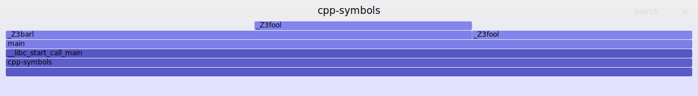

## 启动程序
```bash
./build/cpp-symbols --times=3
times = 3
current trip = 0
current trip = 1
current trip = 2
exit
```

---

## perf
分析
```bash
perf record -F 99 -a -g -p 1937983 -- sleep 10
perf script > out.perf
/usr/local/FlameGraph/stackcollapse-perf.pl out.perf > out.folded
/usr/local/FlameGraph/flamegraph.pl --color=io --title=cpp-symbols out.folded > cpp-symbols.svg

```



---